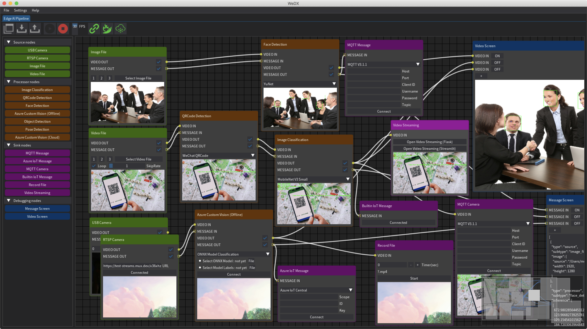

# WeDX



<div align="center">

### Edge AI Pipeline functionality from Edge to Cloud

</div>

----

[](https://github.com/motojinc25/WeDX/releases/tag/wedx-0.10.0)
[](https://www.gnu.org/licenses/agpl-3.0.html)

## 📌 Key Features

- No-code experience to easily build Edge AI pipeline.
- Simple pipeline, Easy to understand code.
- Support Windows, macOS and Linux OS.
- Import and export node configuration.
- Asynchronous processing of frame refresh.
- Container support for arm64v8 and amd64 architecture without GUI.
- Controllable by Azure IoT device. (Azure IoT Central, Azure IoT Hub, Azure IoT Hub DPS)
  - startPipeline
  - stopPipeline
  - importPipeline
  - exportPipeline
- Controllable by Web API using [Flask](https://flask.palletsprojects.com/). (http://localhost:1211)
  - startpipeline[POST]
  - stoppipeline[POST]
  - importpipeline[POST]
  - exportpipeline[POST]
- Integrated [Streamlit](https://streamlit.io/) for Web App.  (http://localhost:1212)
- Controllable Logging Level.
- Three steps in Edge AI pipeline : Source, Process, and Sink.
  - Source nodes
    - USB Camera
    - RTSP Camera
    - Image File
    - Video File
  - Process nodes
    - Image Classification
    - Azure Custom Vision (Cloud)
      - Classification
      - Object Detection
    - Azure Custom Vision (Offline)
      - Classification
      - Object Detection
    - QRCode Detection
    - Face Detection
    - Object Detection
    - Pose Detection
  - Sink nodes
    - Azure IoT Message
    - Builtin IoT Message
    - Record File
    - MQTT Camera
    - MQTT Message
    - Video Streaming
      - Web App with [Flask](https://flask.palletsprojects.com/)
      - Web App with [Streamlit](https://streamlit.io/)
  - Debugging nodes (Option)
    - Message Screen
    - Video Screen


## 📌 Installation

### Windows(amd64)

- Prerequisites
  - [Git client](https://git-scm.com/downloads/)
  - [Python 3.9](https://www.python.org/downloads/windows/)

```
C:\> git clone https://github.com/motojinc25/WeDX
C:\> cd WeDX
C:\> python -m venv .venv
C:\> .\.venv\Scripts\activate.bat
C:\> python -m pip install --upgrade pip
C:\> python -m pip install -r .\requirements\win_amd64.txt
C:\> python .\src\main.py
```

### macOS(x86_64)

- Prerequisites
  - [Python 3.9](https://www.python.org/downloads/macos/)

```bash
$ git clone https://github.com/motojinc25/WeDX
$ cd WeDX
$ python3 -m venv .venv
$ source .venv/bin/activate
$ pip3 install --upgrade pip
$ pip3 install -r requirements/macos_x86_64.txt
$ python3 src/main.py
```

### Linux(x86_64)

- Prerequisites
  - Python 3.9

```bash
$ git clone https://github.com/motojinc25/WeDX
$ cd WeDX
$ python3 -m venv .venv
$ source .venv/bin/activate
$ pip3 install --upgrade pip
$ pip3 install -r requirements/manylinux_x86_64.txt
$ python3 src/main.py
```


## 📌 Usage

### Optional Arguments

```bash
python3 src/main.py [Arguments]

--skip_detect_cameras : Skip camera recognition logic.
--no_gui : Running WeDX without GUI.
--no_webapi : Running WeDX without launching Web API.
--no_webapp : Running WeDX without launching Web App.
```


## 📌 Special thanks

A special thank you goes out to the following rockstars.

- [Jonathan Hoffstadt](https://github.com/hoffstadt) and [Preston Cothren](https://github.com/Pcothren) for creating [Dear PyGui](https://github.com/hoffstadt/DearPyGui/) and providing critical coding insights.
- [Kazuhito Takahashi](https://github.com/Kazuhito00) for creating [Image-Processing-Node-Editor](https://github.com/Kazuhito00/Image-Processing-Node-Editor) and providing node editor coding insights.


## 📌 Licenses

WeDX is available under the GNU AGPL-3.0 license. Licenses of assets, fonts and models are a listed in the appropriate project folders.
