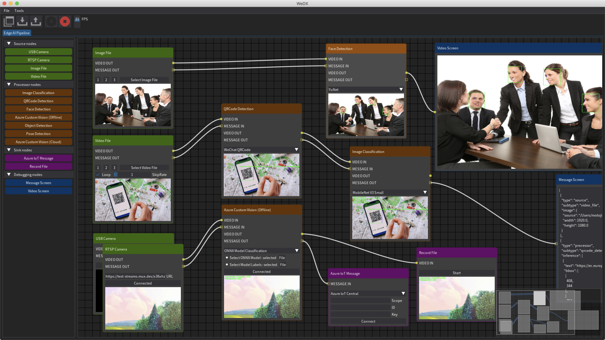

# WeDX



<div align="center">

### Edge AI Pipeline functionality from Edge to Cloud

</div>

----

## 📌 Key Features

- No-code experience to easily build Edge AI pipeline.
- Simple pipeline, Easy to understand code.
- Support Windows, macOS and Linux OS.
- Three steps in Edge AI pipeline : Source, Process, and Sink.
  - Source nodes
    - USB Camera
    - RTSP Camera
    - Image File
    - Video File
  - Process nodes
    - Image Classification
    - Azure Custom Vision (Cloud)
      - Classification
      - Object Detection
    - Azure Custom Vision (Offline)
      - Classification
      - Object Detection
    - QRCode Detection
    - Face Detection
    - Object Detection
    - Pose Detection
  - Sink nodes
    - Azure IoT Message
    - Record File
  - Debugging nodes (Option)
    - Message Screen
    - Video Screen


## 📌 Installation

### Windows(amd64)

- Prerequisites
  - [Git client](https://git-scm.com/downloads/)
  - [Python 3.8 ~ 3.9](https://www.python.org/downloads/windows/)

```
C:\> git clone https://github.com/motojinc25/WeDX
C:\> cd WeDX
C:\> python -m venv .venv
C:\> .venv\Scripts\activate.bat
C:\> python -m pip install --upgrade pip
C:\> python -m pip install -r requirements/win_amd64.txt
C:\> python src/main.py
```

### macOS(x86_64)

- Prerequisites
  - [Python 3.8 ~ 3.9](https://www.python.org/downloads/macos/)

```bash
$ git clone https://github.com/motojinc25/WeDX
$ cd WeDX
$ python3 -m venv .venv
$ source .venv/bin/activate
$ pip3 install --upgrade pip
$ pip3 install -r requirements/macos_x86_64.txt
$ python3 src/main.py
```

### Linux(x86_64)

- Prerequisites
  - Python 3.8 ~ 3.9

```bash
$ git clone https://github.com/motojinc25/WeDX
$ cd WeDX
$ python3 -m venv .venv
$ source .venv/bin/activate
$ pip3 install --upgrade pip
$ pip3 install -r requirements/manylinux_x86_64.txt
$ python3 src/main.py
```


## 📌 Special thanks

A special thank you goes out to the following rockstars.

- [Jonathan Hoffstadt](https://github.com/hoffstadt) and [Preston Cothren](https://github.com/Pcothren) for creating [Dear PyGui](https://github.com/hoffstadt/DearPyGui/) and providing critical coding insights.
- [Kazuhito Takahashi](https://github.com/Kazuhito00) for creating [Image-Processing-Node-Editor](https://github.com/Kazuhito00/Image-Processing-Node-Editor) and providing node editor coding insights.


## 📌 Licenses

WeDX is available under the GNU GPL v3 license. Licenses of assets, fonts and models are a listed in the appropriate project folders.
