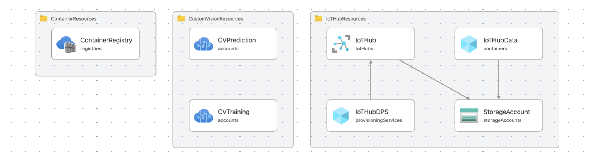

# WeDX

[WeDX](https://github.com/motojinc25/WeDX/) is an open-source utility built with [Python](https://www.python.org/) and [Dear PyGui](https://github.com/hoffstadt/DearPyGui). The app provides a platform for building intelligent video applications with the capability to capture, record, and analyze videos. After that, you can publish the video and insights from video to your local computer or the cloud. You can define a pipeline(flow) with no-code while checking in real-time so that you can combine the three types of nodes (source, processor, and sink) in the node editor, infer the video source with the AI model, and provide the result to the service or application. 

Pipeline handling can be operated by integrating with [Azure IoT](https://azure.microsoft.com/en-us/solutions/iot/) (Azure IoT Hub, Azure IoT Hub DPS, Azure IoT Central, Azure IoT Edge, Azure Percept) other than locally, so it can be used as a [PoC](https://en.wikipedia.org/wiki/Proof_of_concept) for business scenarios. Recently, we have also integrated [Flask](https://flask.palletsprojects.com/) and [Streamlit](https://streamlit.io/) to work with web apps.

It supports x64 Windows, macOS, Linux, and ARM (arm64v8) Linux container without GUI.

[WeDX](https://github.com/motojinc25/WeDX/) was featured on [Dear PyGui's Showcase](https://github.com/hoffstadt/DearPyGui/wiki/Dear-PyGui-Showcase#wedx) page.


<div align="center">

### Building Edge AI Pipelines with No-Code

</div>

----

[](https://github.com/motojinc25/WeDX/releases/tag/wedx-0.13.0)
[](https://www.gnu.org/licenses/agpl-3.0.html)


## 📌 Key Features

- No-code experience to easily build Edge AI pipeline.
- Simple pipeline, Easy to understand code.
- Support x64 Windows, macOS and Linux OS.
- Support container for arm64v8 and amd64 architecture without GUI.
- Import and export node configuration.
- Asynchronous processing of frame refresh.
- [Netron](https://github.com/lutzroeder/netron) integration for visualizing neural network models.
- Controllable by Azure IoT Edge device. (Azure IoT Edge, Azure IoT Edge DPS, Azure Percept, Azure IoT Central)
  - startPipeline
  - stopPipeline
  - importPipeline
  - exportPipeline
- Controllable by Azure IoT device. (Azure IoT Hub, Azure IoT Hub DPS, Azure IoT Central)
  - startPipeline
  - stopPipeline
  - importPipeline
  - exportPipeline
- Controllable by Web API using [Flask](https://flask.palletsprojects.com/). (http://localhost:1211)
  - startpipeline[POST]
  - stoppipeline[POST]
  - importpipeline[POST]
  - exportpipeline[POST]
- Integrated [Streamlit](https://streamlit.io/) for Web App. (http://localhost:1212)
- Controllable Logging Level.
- Three steps in Edge AI pipeline : Source, Process, and Sink.
  - Source nodes
    - USB Camera
    - RTSP Camera
    - Image File
    - Video File
  - Process nodes
    - Image Classification
    - Azure Custom Vision (Cloud)
      - Classification
      - Object Detection
    - Azure Custom Vision (Offline)
      - Classification
      - Object Detection
    - QRCode Detection
    - Face Detection
    - Object Detection
    - Pose Detection
  - Sink nodes
    - Azure IoT Message
    - Builtin IoT Message
    - Record File
    - MQTT Camera
    - MQTT Message
    - Video Streaming
      - Web App with [Flask](https://flask.palletsprojects.com/)
      - Web App with [Streamlit](https://streamlit.io/)
  - Debugging nodes (Option)
    - Message Screen
    - Video Screen


## 📌 Get Started

### Prerequisites

- [Git client](https://git-scm.com/downloads/)
- [Python 3.9](https://www.python.org/downloads/)

### Windows(x64)

```
C:\> git clone https://github.com/motojinc25/WeDX
C:\> cd WeDX
C:\WeDX> python -V
Python 3.9.*
C:\WeDX> run-wedx.bat
```

### Windows 11 WSL2 with CUDA(x64)

- Install NVIDIA Graphic Card Driver (Windows 11)
- Install CUDA Toolkit (CUDA 11.4, Ubuntu 20.04)
- Download [ZLIB DLL](https://www.dll-files.com/zlib.dll.html)
- Install cuDNN (CUDA 11.4, Ubuntu 20.04)

```
C:\> git clone https://github.com/motojinc25/WeDX
C:\> cd WeDX
C:\WeDX> python -V
Python 3.9.*
C:\WeDX> run-wedx.bat
```

### macOS(x64) / Linux(x64)

```bash
$ git clone https://github.com/motojinc25/WeDX
$ cd WeDX
$ python3 -V
Python 3.9.*
$ ./run-wedx.sh
```


## 📌 Usage

### Optional Arguments

```bash
python3 src/main.py [Arguments]

--skip_detect_cameras : Skip camera recognition logic.
--no_gui : Running WeDX without GUI.
--no_webapi : Running WeDX without launching Web API.
--no_webapp : Running WeDX without launching Web App.
--iotedge : Connecting to Azure IoT Edge
```


## Azure Bicep Templates

[Azure Bicep](https://docs.microsoft.com/en-us/azure/azure-resource-manager/bicep/overview) under "[infra/azure/*.bicep](./infra/azure/README.md)" can quickly deploy Azure cloud resources supported by the latest version of WeDX.




## 📌 Special thanks

A special thank you goes out to the following rockstars.

- [Jonathan Hoffstadt](https://github.com/hoffstadt) and [Preston Cothren](https://github.com/Pcothren) for creating [Dear PyGui](https://github.com/hoffstadt/DearPyGui/) and providing critical coding insights.
- [Kazuhito Takahashi](https://github.com/Kazuhito00) for creating [Image-Processing-Node-Editor](https://github.com/Kazuhito00/Image-Processing-Node-Editor) and providing node editor coding insights.


## 📌 Licenses

WeDX is available under the GNU AGPL-3.0 license. Licenses of assets, fonts and models are a listed in the appropriate project folders.
