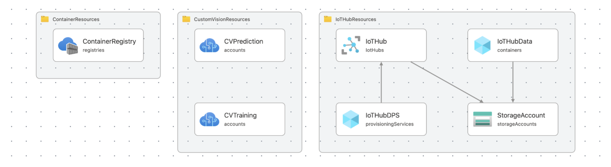

# Azure Bicep Templates for WeDX

This is a set of Bicep templates developed to help creating Azure infrastructure for WeDX.



## Run with PowerShell

### Azure Custom Vision

```
$resourceGroupName='<RESOURCE-GROUP-NAME>'
$templateFile='custom-vision.bicep'
New-AzResourceGroup -Name $resourceGroupName -Location $location
New-AzResourceGroupDeployment -ResourceGroupName $resourceGroupName -TemplateFile $templateFile
```

### Azure IoT Hub

```
$resourceGroupName='<RESOURCE-GROUP-NAME>'
$templateFile='iot-hub.bicep'
New-AzResourceGroup -Name $resourceGroupName -Location $location
New-AzResourceGroupDeployment -ResourceGroupName $resourceGroupName -TemplateFile $templateFile
```

### Azure Container Registry

```
$resourceGroupName='<RESOURCE-GROUP-NAME>'
$templateFile='container.bicep'
New-AzResourceGroup -Name $resourceGroupName -Location $location
New-AzResourceGroupDeployment -ResourceGroupName $resourceGroupName -TemplateFile $templateFile
```
